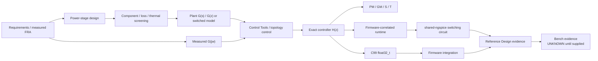

# Power Design Toolkit

> **Open-source power electronics CAE toolkit for LLC, PFC, FRA, digital control, C99 code generation and switching verification.**

LLC · Totem-Pole PFC · Vienna PFC · Digital Control · FRA · C99 `float32_t` · ngspice · Web API · MCP

[](https://github.com/yangshuai2022-star/power-design-toolkit/actions/workflows/build-release.yml)
[](https://github.com/yangshuai2022-star/power-design-toolkit/actions/workflows/ngspice-smoke.yml)


[](https://github.com/yangshuai2022-star/power-design-toolkit/releases/latest)


Power Design Toolkit is an engineering-oriented power-electronics design and digital-control platform. It connects **power-stage design, component/loss screening, multi-fidelity models, measured FRA data, exact discrete controller H(z), stability analysis, C99 code generation, firmware-correlated switching co-simulation and Agent/API access** in one codebase.

The project is built around four rules:

1. **One engineering model, multiple front ends.** Desktop GUI, CLI, Web/API, MCP and code generation reuse shared Python kernels instead of re-implementing equations in each interface.
2. **Exact digital-control semantics.** A designed discrete transfer function is passed as its real `b/a` coefficients; it is not silently re-fit into a different PI/PID form or re-discretized inside downstream simulation.
3. **Model boundaries are explicit.** FHA, HB, switched time-domain, measured FRA, small-signal Bode, firmware runtime and ngspice answer different questions.
4. **Evidence is not collapsed into one word.** Software regression, simulator execution and hardware validation are separate evidence levels.


---

## 1. 30-second engineering workflow



A typical LLC path is:

```text
400 V -> 53 V / 3 kW specification
    -> Lr / Cr / Lm and operating region
    -> primary / SR device selection and comparison
    -> FHA / HB / switched-TD comparison
    -> digital voltage-loop model
    -> exact H(z) controller
    -> PM / GM / sensitivity checks
    -> C99 float32_t export
    -> shared-ngspice switching correlation
    -> traceable evidence matrix
```

A typical single-phase TTPL PFC path is:

```text
Vin / Vbus / Pout / fsw specification
    -> Lboost / Cbus sizing
    -> MOSFET / loss / thermal screening
    -> settled AC line cycle / PF / THD
    -> switching / zero-crossing verification
    -> sensing / ADC / current + voltage loop design
    -> exact current + voltage H(z)
    -> C99 contract
    -> float32 sensing / ADC / delay / anti-windup / zero-cross runtime
    -> shared-ngspice four-switch closed loop
    -> hardware correlation
```

The first maintained reference case is [`LLC_400V_53V_3kW`](reference_designs/LLC_400V_53V_3kW/README.md). Its bench status is intentionally `UNKNOWN`; software evidence is not presented as hardware sign-off.

---

## 2. Four engineering workspaces

The desktop launcher opens four independent workspaces while preserving state during switching.

| Workspace | Main purpose | Typical outputs |
| --- | --- | --- |
| **LLC Design** | Resonant tank, operating region, Q/ZVS, magnetics, primary/SR devices, interleaving, waveforms, small signal and digital voltage loop | Lr/Cr/Lm, gain map, device/loss comparison, stress data, FHA/HB/TD comparison, Gvf(s/z), exact H(z), PM/GM, shared-ngspice closed-loop verification |
| **PFC Design** | Single-phase TTPL engineering workflow plus three-phase Vienna PFC | L/C sizing, device/loss/thermal screening, AC PF/THD, zero-crossing and switching waveforms, sensing/ADC, current/voltage H(z), C99, shared-ngspice TTPL closed loop |
| **Control Tools** | General digital controller/filter design | H(s), exact H(z), Bode, step/impulse, poles/zeros, SOS/DF2T, single-file C99 `float32_t` |
| **FRA Loop Designer** | Controller design from measured frequency response | Bode100/SIMPLIS import, controller de-embedding, Equivalent Plant, Fc/PM/GM/Ms/Mt, Auto Design, model ID, C99 |

### Smart Control / Guided System Design (V9.4)

From the launcher, **系统建模与设计 / Guided System Design** builds a canonical closed-loop definition for LLC FM voltage-loop or single-phase Totem-Pole PFC (current + bus voltage), then hands it into the existing design/control engines. An interactive **Fc–PM Solution Map** synthesizes candidate loops and installs only constraint-feasible points into the LLC/TTPL workspaces.

V9.4 integrates the eight-step workflow: **Topology → Power Stage → Sensing → ADC → Modulator → Timing → Controller → Review**, with live summaries and guided-definition re-entry. The new LLC envelope/ZVS/FHA–TD/loss-provenance/thermal/optimizer foundations are described in [LLC Physics Model V2](docs/LLC_PHYSICS_MODEL_V2.md).

V9.4.2 retains the shared-data packaging correction and verified Windows/macOS publication gates from 9.4.1, and fixes the Windows UTF-8 test-fixture failure. Use the latest complete release; earlier tags are retained for history. See [Release process](docs/RELEASE.md).

Roadmap placeholders for other topologies are shown explicitly — they are not silently claimed as supported. Solution Map synthesis currently targets Tustin PI. Some advanced physics paths remain API/opt-in and are not yet integrated into every default GUI/PDF/Web consumer; see the explicit [model limitations](docs/LLC_MODEL_VALIDATION_REPORT.md).

---

## 3. LLC capability

### Electrical design and multi-fidelity analysis

The LLC workspace keeps several model levels instead of forcing one solver to do every job:

- **FHA** — fast fundamental-harmonic design baseline for tank synthesis, gain and operating-point work.
- **Nonlinear multi-harmonic HB** — selected odd harmonics with rectifier commutation/polarity coupling.
- **Internal switched time-domain solver** — piecewise nonlinear switching model with periodic steady-state solution.
- **shared-ngspice verification** — optional circuit-level switching correlation driven by the toolkit's discrete controller runtime.

The analysis also includes multi-load Q/gain maps, theoretical and engineering ZVS regions, operating trajectories, waveform reconstruction, transformer/resonant-inductor design, synchronous-rectifier timing/loss analysis, and fixed 2-phase/3-phase interleaved LLC analysis.

### Primary / SR device library

The LLC workspace includes built-in engineering-reference MOSFET records for primary and synchronous-rectifier positions, plus a persistent user library.

Current device-library workflow includes:

- Primary MOSFET and SR MOSFET selection;
- create / edit / clone / delete user records;
- JSON import/export;
- built-in reference data kept separate from user data;
- device comparison using the current LLC operating point;
- conduction, turn-off, gate, Coss/deadtime and ZVS-margin related screening where the model provides the required data.
Built-in generic/reference devices are not presented as vendor hardware sign-off. Datasheet curves and traceable vendor provenance remain a higher-fidelity data layer.

### Digital voltage-loop chain

```text
Vref
 -> C(z)
 -> PCMD clamp
 -> PCMD/Frequency or PCMD/TBPRD FM block
 -> PWM / ZOH / timing delay
 -> Gvf
 -> Vout
 -> analog sensing
 -> ADC / multi-SOC / recursive averaging
 -> feedback
```

The analyzer reports detected gain/phase crossovers, phase/gain margins, sensitivity/complementary sensitivity, delay envelopes, discrete closed-loop poles, command headroom and polarity diagnostics.

### ngspice boundary

The current ngspice layer is a **switching-correlation model**, not a vendor semiconductor sign-off model. It does not claim release-accurate nonlinear Coss commutation, Qrr, switching loss, ringing or SR device stress.

See [ngspice closed-loop architecture](docs/NGSPICE_CLOSED_LOOP.md).

---

## 4. PFC capability

### Single-phase TTPL Engineering Workspace

The TTPL path is organized as an explicit eight-stage engineering workflow:

```text
1. Power Stage / Sizing
        ↓
2. Devices / Loss
        ↓
3. Capacitor / Thermal
        ↓
4. AC Line / PF / THD
        ↓
5. Switching / Zero Crossing
        ↓
6. Control / Sensing / Bode
        ↓
7. Exact H(z) / C99
        ↓
8. Closed-Loop Verification
```

#### Power stage / hardware sizing

The deterministic engineering kernel covers specification-to-hardware calculations including:

- low-line input RMS/peak current;
- duty trajectory over the AC half-cycle;
- boost-inductor ripple scan and required `Lboost`;
- twice-line bus-ripple capacitance requirement;
- hold-up capacitance requirement;
- physical capacitor-bank selection and ESR transfer into downstream models.

#### Devices / loss / thermal

TTPL device screening includes HF active/synchronous positions and the line-frequency leg. The device database supports packaged records plus persistent user JSON records. Loss/thermal calculations remain engineering screening models; nonlinear vendor Coss/Qrr/Eon/Eoff surfaces and detailed heatsink/airflow correlation are separate fidelity layers.

#### AC line / PF / THD / switching

The time-domain PFC path provides:

- settled AC-line-cycle reconstruction;
- signed grid current versus rectified inductor current semantics;
- PF, displacement/distortion factor and integer-harmonic THD;
- DC-bus ripple and capacitor RMS current;
- selected-workpoint switching waveforms;
- minimum-pulse and zero-crossing state-machine observability.

#### Exact H(z) and C99 handoff

The analyzed current and voltage controllers are promoted into a formal `PFCControlHandoff` containing exact normalized `b[]`, `a[]`, sample rates, limits, provenance and nonlinear implementation semantics.

```text
H(z) = (b0 + b1 z^-1 + ...)/(1 + a1 z^-1 + ...)
y[n] = sum(b[k] x[n-k]) - sum(a[k] y[n-k])
```

Downstream PFC simulation consumes those coefficients directly. **No Kp/Ti reconstruction and no second S-to-Z conversion are allowed in the closed-loop handoff.**

The Exact H(z) stage can export the JSON contract and an audited C99 package.

#### Firmware-correlated shared-ngspice closed loop

The TTPL closed-loop verifier now connects the frozen H(z) controllers to a four-switch shared-ngspice power stage. The current fidelity layer includes:

- float32 controller/state execution;
- PI/PIF conditional-integrator anti-windup derived from the frozen discrete controller identity;
- 2P2Z clamped-output history semantics;
- configured analog sensing poles;
- ADC-resolution quantization in calibrated engineering units;
- multi-SOC recursive averaging and digital filtering;
- configured control/computation/PWM timing;
- PWM shadow-application timing;
- eight-state TTPL zero-crossing runtime with PI reset and commutation states;
- line-polarity-aware HF/LF gate scheduling;
- real `libngspice` continuous inductor/capacitor state between digital events.

This is **firmware-correlated switching co-simulation**, not a claim of instruction-level C2000 bit identity. The current schema does not yet encode board-specific ADC common-mode offset/rail clipping, full MCU peripheral register behavior, vendor nonlinear semiconductor models, layout parasitics or protection-state-machine hardware correlation.

See [PFC Engineering Workspace](docs/PFC_ENGINEERING_WORKSPACE.md), [Exact H(z) handoff](docs/PFC_EXACT_HZ_HANDOFF.md) and [ngspice closed-loop architecture](docs/NGSPICE_CLOSED_LOOP.md).

### Three-phase Vienna PFC

Vienna currently includes:

- DC-voltage outer loop plus stationary-frame ABC current loops;
- split-bus midpoint balance loop;
- three-phase voltage/current and split-bus sensing;
- common-mode / third-harmonic modulation support;
- full three-phase line-cycle solution and sector analysis;
- three-level switching waveforms;
- per-phase PF/THD and power analysis.

The TTPL engineering architecture is the migration template for the future Vienna hardware-design / exact-H(z) / circuit-level closed-loop path.

---

## 5. Control Tools

`power_control_tools` is the common controller/filter engine used across the project.

Current structures include:

`Integrator · PI · PIF · PID · PIDF · Type-II · Type-III · Modified PI · Lead · Lag · 1P1Z · 2P2Z · 3P3Z · General`

Supported workflows include:

- analog controller/filter definition;
- Tustin, prewarped Tustin and backward-Euler discretization;
- exact discrete frequency response;
- Bode, step/impulse and pole-zero analysis;
- DF2T/SOS coefficient representation;
- single-file C99 `float32_t` export;
- generated-C verification against the Python reference when a C compiler is available.

Canonical coefficient convention:

```text
H(z) = (b0 + b1 z^-1 + ...)/(1 + a1 z^-1 + ...)

y[k] = Sum(bi*x[k-i]) - Sum(aj*y[k-j])
```

See [Digital control architecture](docs/DIGITAL_CONTROL_ARCHITECTURE.md).

---

## 6. FRA Loop Designer

The FRA workspace is the measured-frequency-response path for controller redesign and verification.

### Import formats

- **Bode100 CSV**
- **SIMPLIS TXT** (`frequency / gain / phase`)
- **Generic frequency/gain/phase** text or CSV

The GUI does not infer physical meaning merely from file columns. The user explicitly selects whether the measurement is:

- **Plant TS** — already the plant/equivalent response; or
- **Complete Loop TS** — includes the existing controller and requires de-embedding.

For a measured complete loop:

```text
L_meas(jw) = C_old(jw) * G_rest(jw)
G_rest(jw) = L_meas(jw) / C_old(jw)
L_new(jw)  = C_new(jw) * G_rest(jw)
```

Raw measured complex points remain the authority for crossover and stability metrics. Low-order rational identification is optional and does not overwrite the measurement.

See [FRA Loop Designer engineering contract](docs/FRA_LOOP_DESIGNER.md).

---

## 7. Evidence-driven engineering

Power Design Toolkit distinguishes **software reproducibility**, **model correlation** and **hardware validation**.

| Evidence | Current meaning | Hardware verified |
| --- | --- | ---: |
| Python regression | Repository baseline reproduces within maintained tolerances | No |
| Internal FHA/HB/TD and PFC time-domain comparison | Model implementations can be regression-tested | No |
| Real ngspice path | Real simulator/runtime plumbing executes in CI, including shared-library closed-loop paths | No |
| Firmware-correlated runtime | float32/state/timing semantics can be regression-tested against the software contract | No |
| Bench measurement | `UNKNOWN` unless raw evidence and conditions are supplied | No by default |

The common rule is:

```text
analytical model
 -> higher-fidelity software model
 -> firmware-correlated runtime
 -> circuit simulation
 -> measured hardware
 -> reviewed release evidence
```

Passing an earlier stage is evidence, not permission to skip a later stage.

Start with:

- [Engineering validation policy](docs/ENGINEERING_VALIDATION.md)
- [Reference Designs](reference_designs/README.md)
- [Project JSON / provenance contract](docs/PROJECT_PROVENANCE.md)
- [Engineering device/magnetics data policy](docs/ENGINEERING_DATA.md)

---

## 8. Install and run

### Binary packages (recommended for end users)

Download the latest Windows / macOS build from GitHub Releases:

**[https://github.com/yangshuai2022-star/power-design-toolkit/releases/latest](https://github.com/yangshuai2022-star/power-design-toolkit/releases/latest)**

| Asset | Platform |
| --- | --- |
| `PowerDesignTool-Windows-x64.zip` | Windows 11 x64 — extract and run `PowerDesignTool.exe` |
| `PowerDesignTool-macOS-arm64.zip` | macOS Apple Silicon — extract and run `PowerDesignTool.app` |

Unsigned macOS builds may need Finder **Open** once, or clearing quarantine on the downloaded app. CI gates for these zips are described in [Release process](docs/RELEASE.md); they prove software reproducibility, not hardware sign-off.

### Requirements (from source)

- Python **3.10+**
- Windows / macOS / Linux
- PySide6 only for the desktop GUI
- ngspice/libngspice only for the optional SPICE path

### Core / CLI

```bash
python -m pip install -e .
```

### Desktop GUI

```bash
python -m pip install -e ".[gui]"
power-design-gui
```

Source-tree launchers (`LLC工具.command` / `LLC工具.bat`, or the repo-root `.command` / `.bat` scripts) start the same desktop GUI when present.

Equivalent source-tree entry:

```bash
python -m llc_design gui
```

### Web edition

```bash
python -m pip install -e ".[web]"
power-design-web
```

Then open `http://127.0.0.1:8000`.

### Agent / MCP edition

```bash
python -m pip install -e ".[agent]"
power-design-mcp
```

The MCP server uses the official Python SDK v2 and defaults to local stdio. See [Agent / MCP interface](docs/AGENT_MCP.md).

### Development environment

```bash
python -m pip install -e ".[dev,gui,web,agent]"
pytest
```

### Installed CLI entry points

```text
llc-design
pfc-design
pfc-control-lab
vienna-control-lab
power-control-tools
power-control-codegen
power-design-gui
power-design-web
power-design-mcp
```

---

## 9. Agent / MCP principle

The Agent layer follows one rule:

> **LLM for requirement interpretation and orchestration; deterministic kernels for engineering computation.**

Initial MCP tools expose LLC defaults/analysis, toolkit capabilities and engineering-data provenance. Agent results explicitly retain their software-model scope and keep `verified_for_hardware=false` unless separate evidence proves otherwise.

```text
ChatGPT / Claude / Codex / MCP host
               |
               v
        Power Design MCP
               |
               v
      deterministic kernels
        /       |       \
      LLC      PFC    Control/FRA
```

---

## 10. Web/API edition

The browser UI does not duplicate engineering equations. FastAPI calls the same Python kernels used by desktop/CLI paths.

Current LLC endpoints include:

```text
GET  /api/health
GET  /api/llc/defaults
POST /api/llc/analyze
GET  /api/llc/cores
POST /api/llc/optimize
POST /api/llc/report
POST /api/llc/report.xlsx
GET  /docs
```

Control API routes are mounted from `backend.api.control` into the same application.

See [Web deployment](docs/WEB_DEPLOYMENT.md).

---

## 11. CI and release gates

Two CI layers are especially important:

- **build-release** — regression suite, package/version contract, real packaged-app `--self-test`, release artifacts;
- **ngspice-smoke** — installs real `ngspice` + `libngspice` and exercises switching integration rather than mocking the simulator.

The ngspice smoke suite now covers both LLC and TTPL integration paths. The packaged-app self-test constructs all four Qt workspaces offscreen and validates bundled data provenance. A release no longer passes merely because a PyInstaller directory exists.

### How releases are published

The supported publish path is **version bump on `main` → CI creates `vX.Y.Z` → packaging → GitHub Release**. Do not hand-tag a mismatched version.

Full checklist and recovery steps: **[docs/RELEASE.md](docs/RELEASE.md)**.

A reproducible real launcher screenshot can be generated with:

```bash
python scripts/capture_readme_screenshot.py docs/assets/power-design-toolkit-overview.png --language en
```

CI also produces the same screenshot as an artifact; the README should only embed a real captured UI image, never a mock.

---

## 12. Repository layout

```text
llc_design/            LLC engineering, models, dynamics, control, GUI, reports
pfc_design/            TTPL/Vienna engineering, control, firmware runtime and GUI
power_control_tools/   Generic controller/filter/FRA engine
power_codegen/         Portable C99 float32_t control-code generation
power_sim/             Backend-neutral digital runtime + LLC/PFC SPICE integration
power_agent/           Deterministic Agent wrappers + MCP v2 server
backend/               Shared backend/control API services
webapp/                FastAPI application + browser front end
reference_designs/     Traceable cases + evidence matrices
engineering_data/      Cross-workspace data catalog
schemas/               Shared project/provenance schemas
release_validation/    Version-controlled numerical regression baselines
docs/                  Maintained engineering documentation
.github/workflows/      CI, release and real-ngspice validation
```

---

## 13. Documentation

Start here instead of reading historical version notes:

- [Documentation index](docs/README.md)
- [Digital control architecture](docs/DIGITAL_CONTROL_ARCHITECTURE.md)
- [LLC model hierarchy and boundaries](docs/LLC_MODELING.md)
- [PFC Engineering Workspace](docs/PFC_ENGINEERING_WORKSPACE.md)
- [PFC Exact H(z) handoff](docs/PFC_EXACT_HZ_HANDOFF.md)
- [FRA Loop Designer engineering contract](docs/FRA_LOOP_DESIGNER.md)
- [ngspice closed-loop architecture](docs/NGSPICE_CLOSED_LOOP.md)
- [Engineering validation policy](docs/ENGINEERING_VALIDATION.md)
- [Project provenance](docs/PROJECT_PROVENANCE.md)
- [Engineering data policy](docs/ENGINEERING_DATA.md)
- [Agent / MCP](docs/AGENT_MCP.md)
- [Web deployment](docs/WEB_DEPLOYMENT.md)
- [Release process](docs/RELEASE.md)
- [Changelog](CHANGELOG.md)

The application also contains an offline **Help / F1** system in all four workspaces, including implementation notes, model boundaries and known limitations.

---

## 14. Language support

Desktop UI/help currently supports:

- 简体中文
- English
- 日本語
- 한국어

Engineering identifiers such as `Bode`, `H(z)`, `C99`, `Kp`, `PM`, `GM`, `FRA` and component/model names intentionally remain stable across languages.

---

## 15. Contact

**Yang Shuai / 杨帅**  
Power Electronics · Digital Power · Embedded Control · Control Algorithms

- GitHub: `yangshuai2022-star`
- Email: `maileyang@qq.com`
- WeChat: `maileyang`
- Technical blog / WeChat official account: **开关电源仿真与实用设计**


For bug reports, include the toolkit version, topology/workspace, input parameters, expected result, actual result and relevant screenshot/export whenever possible.

---

## 16. License

GNU GPL v3.0 — see [LICENSE](LICENSE).